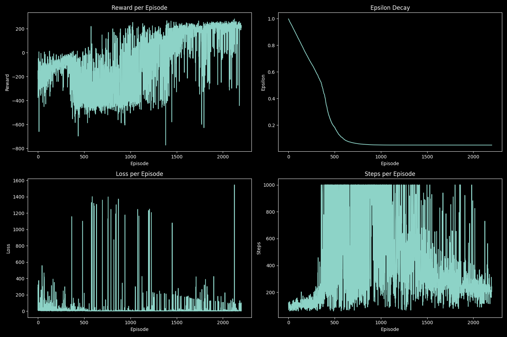
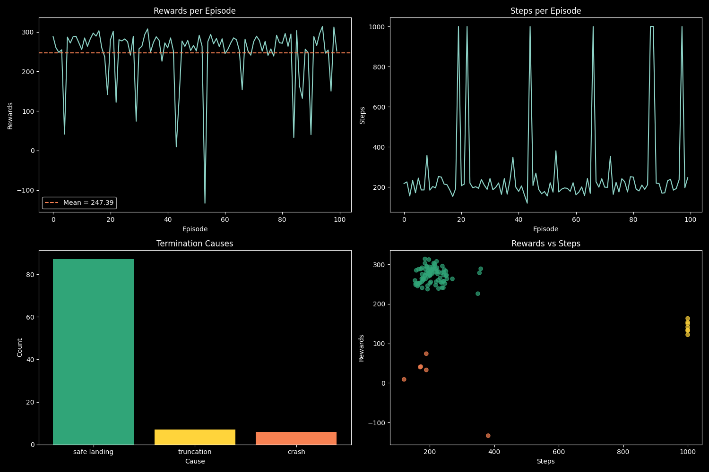

# analyse.py

## Purpose
Generates diagnostic plots from training or evaluation CSV logs and saves PNG files.

## Usage
```bash
	python -m scripts.analyse --type train --filename outputs/logs/<config_name>_log.csv
	python -m scripts.analyse --type eval --filename outputs/logs/<config_name>_eval_log0.csv
```

## Command-line arguments (get_args)
As above, the script takes two required arguments:
- **--type**: either "train" or "eval" to specify the type of log being analyzed.
- **--filename**: the path to the CSV log file to analyze.

The function **get_args()** aims to parse these arguments and return them for use in the script.
Depending on the **--type** argument, it will call either **plot_training_data** or **plot_evaluation_data** with the provided filename.

## Plotting functions
The script contains two main plotting functions:
- **plot_training_data(file_path)**: generates plots for training logs.
- **plot_evaluation_data(file_path)**: generates plots for evaluation logs.

Both functions use matplotlib to create visualizations of the data contained in the CSV logs. The specific plots generated differ between training and evaluation logs, as they contain different types of information.
Pandas library is used to read the CSV files into DataFrames for easier manipulation and plotting.

## Train plots (plot_training_data)
### Example


### First plot: Rewards per episode
This plot shows the total reward obtained in each episode of training. It also includes a line for the mean reward over time to help visualize trends.

### Second plot: Epsilon per episode
This plot shows how the epsilon value (used for exploration in DQN) changes over the course of training. Typically, epsilon starts high to encourage exploration and decreases over time.

### Third plot: Loss per episode
This plot shows the loss value from the training step in each episode. It can help identify if the training is converging (loss decreasing) or if there are issues (loss increasing or fluctuating wildly).

### Fourth plot: Steps per episode
This plot shows the number of steps taken in each episode. It can indicate how long the agent is surviving or how quickly it is learning to complete the task.
To remember that an episode can be no longer than 1000 steps, that number can be smaller if the configuration allows for shorter episodes.

## Eval plots (plot_evaluation_data)
### Example


### First plot: Rewards per episode
Like the training plot, this shows the total reward obtained in each episode of evaluation. Here, it also includes a line for the mean reward to visualize trends.
An agent is considered to have successfully learned if the mean reward over 100 episodes is above 200.

### Second plot: Steps per episode
Like the training plot, this shows the number of steps taken in each episode of evaluation.

### Third plot: Termination cause
This bar chart shows the count of different termination causes across all evaluation episodes. The termination causes are:
- <span style="color:#30a578">safe landing</span>
- <span style="color:#ffd43b">truncation</span>
- <span style="color:#f78152">crash</span>
- <span style="color:#861fa3">out of viewport</span>
- <span style="color:#1f77b4">sleep</span>

### Fourth plot: Rewards vs Steps
This scatter plot shows the relationship between the total reward obtained and the number of steps taken in each episode of evaluation. It can help identify if there is a correlation between how long the agent survives and how much reward it obtains.
The color of the points in this plot corresponds to the termination cause.

## Outputs
The script generates PNG files with the same base name as the input CSV log file, saved in the same directory.
For example, if the **--filename** argument is **outputs/logs/<config_name>_log.csv**, the output will be **outputs/logs/<config_name>_log.png**.

## Expected columns
Both training and evaluation CSV logs are expected to have specific columns for the plotting functions to work correctly. The script will ignore any additional columns that are not relevant to the plots.

### Train
- **episode**: the episode number.
- **reward**: the total reward obtained in that episode.
- **epsilon**: the epsilon value used in that episode.
- **loss**: the loss value from the training step in that episode.
- **steps**: the number of steps taken in that episode.

### Eval
- **episode**: the episode number.
- **rewards**: the total reward obtained in that episode.
- **steps**: the number of steps taken in that episode.
- **termination_cause**: the reason why the episode ended.

## Notes
- Plots are saved as PNG files and not displayed interactively.